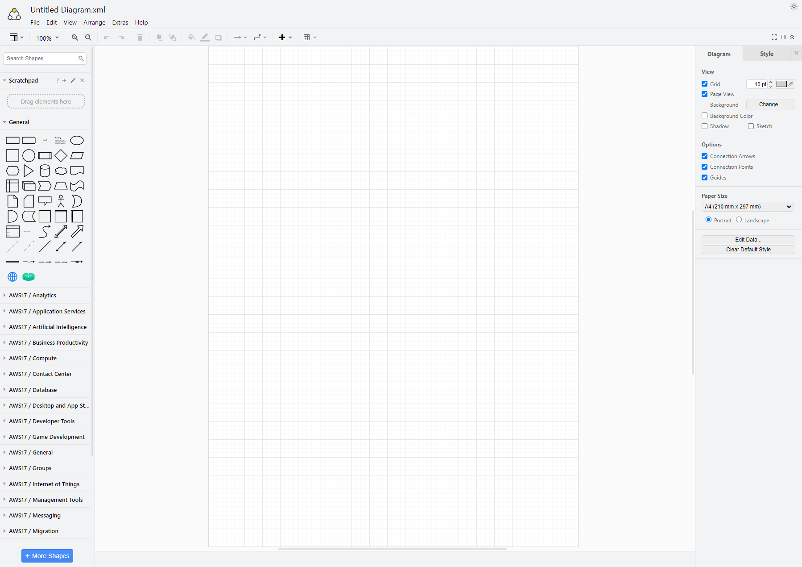
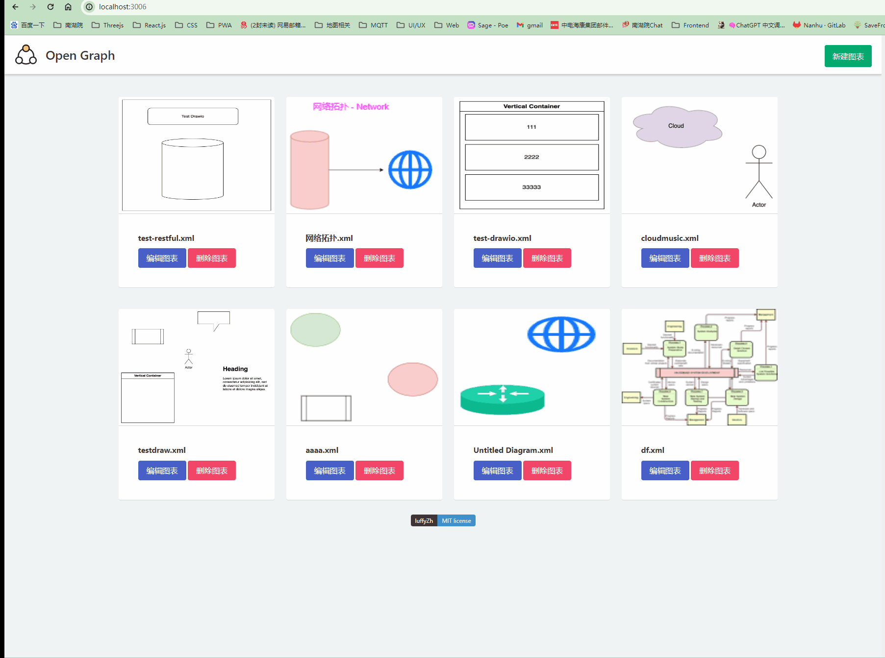
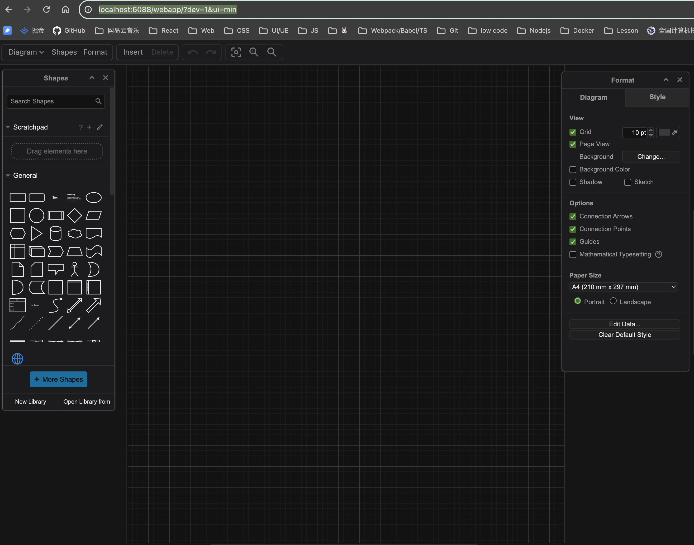
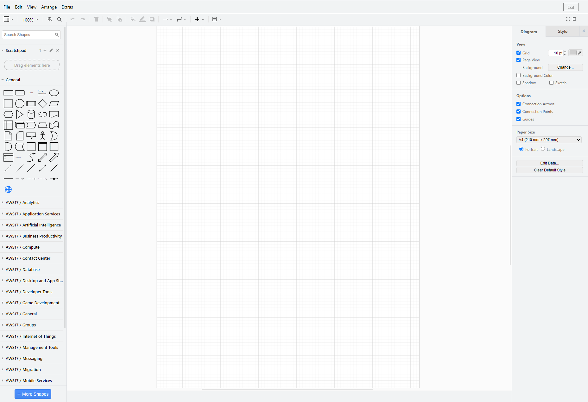

# Open Graph 开发文档

## 项目形态

项目是一个纯前端单独部署的项目，交互方式上来说既可以作为单独的一个系统部署，也可以作为一个单独的子模块嵌套，但是子模块嵌套也是部署后通过 Iframe 的方式。

> 如果要实现交互，需要后端进行接口的实现。推荐使用 RESTFUL 方案实现增删改查。

### 单独的绘图模块

目前提供的 `drawio` 文件夹，就是一个可以单独部署的图表前端，入口文件就是 `drawio/index.html`。部署完成后效果如下：



### 子模块嵌套

为了适配多样化需求，比如作为一个子模块，嵌入到现有系统里，那么可以采用 iframe 的方式进行集成，同时 DRAWIO 内部对嵌套模式做了一定程度的样式优化，具体效果如下:



## 如何部署

`drawio` 包就是一个独立的前端构建好的项目，项目唯一入口 `drawio/index.html`，因此采用正常的前端部署方式都是可以的，常用的就是作为静态服务部署到服务器，然后通过 Nginx 做负载均衡。

## 接口相关

图表相关字段包括：

```json
{
  "title": "", // 图表标题
  "topodata": "", // 图表内容
  "thumbnail": "", // 图表缩略图
  "author": "", // 作者
  "svg": "", // 等比例 SVG 文件
  "create_at": "", // 创建时间
  "update_at": "" // 更新时间
}
```

| 接口                    | 描述             |
| ----------------------- | ---------------- |
|                         | 获取所有图表列表 |
|                         | 获取图表详情     |
| 获取                    | 新建图表         |
| 添加自定义 SVG 图形     | 更新图表         |
| 拖拽添加属性（ip/port） | 删除图表         |

### 接口实现

DRAWIO 独立部署系统需要有后端实现对应接口，前端只需要将对应的几个接口内容在 `drawio/js/bridge/request.js` 内部去实现即可，所有的弹出层消息逻辑都交由用户来处理，图标系统只负责调用接口获取数据以及调用接口存储数据。

> 目前这一版的接口参考公司后端提供的接口文档实现：https://www.showdoc.com.cn/2467461915549186/10954970896782134

## 可扩展功能

系统理论上对外是一个黑盒模式运行，但是出于不同场景可扩展的需求，开放了一些口子供用户自定义需求，具体如下：

### 嵌套模式

前面提到过，DRAWIO 既可以作为独立的绘图网站部署，也可以作为单独的子模块。当作为子模块时，推荐使用 Iframe 的方式进行嵌入，同时系统内部提供了两种嵌套布局方案。

> 【注意】：无论是哪种方式，DRAWIO 都是单独部署的，假设已经部署的服务地址为：`https://custom-drawio.com/`。

- UI 精简模式

可以通过添加 `ui=min` 参数实现进入系统即进入 UI 精简模式，UI 精简模式效果如下：



- 原生精简模式

UI 精简模式下的样式，对于某些需要查看属性以及需要大量绘图图形的场景下不太友好，因此额外开发了一个原生精简模式，可以通过 `iframe=1` 参数进行设置，效果如下：



> 两种模式根据自己的需求，在内嵌模式下进行选择即可。

### 主子页面通信（嵌套模式下）

当系统处于嵌套模式下的时候，不可避免地要进行一些主页面和子页面的通信，系统开放了几个口子用于主子页面通信，具体文件位置 `drawio/js/bridge/init.js`：

- 退出嵌套模式可配置按钮样式

```js
/**
 * 自定义退出 icon
 */
window.EXIT_SYSTEM_ICON =
  "data:image/svg+xml;base64,PHN2ZyB0PSIxNzA5NjI4MDMyMTE0IiBjbGFzcz0iaWNvbiIgdmlld0JveD0iMCAwIDEwMjQgMTAyNCIgdmVyc2lvbj0iMS4xIiB4bWxucz0iaHR0cDovL3d3dy53My5vcmcvMjAwMC9zdmciIHAtaWQ9IjEwMjk5IiB3aWR0aD0iNDgiIGhlaWdodD0iNDgiPjxwYXRoIGQ9Ik04MjkuNDQgODgyLjY4OGgtNjM0Ljg4Yy0yOC42NzIgMC01My4yNDgtMjQuNTc2LTUzLjI0OC01My4yNDh2LTYzNC44OGMwLTI4LjY3MiAyNC41NzYtNTMuMjQ4IDUzLjI0OC01My4yNDhoNjM0Ljg4YzI4LjY3MiAwIDUzLjI0OCAyNC41NzYgNTMuMjQ4IDUzLjI0OHYxMDcuODYxMzMzYzAgMTEuNjA1MzMzLTguODc0NjY3IDIwLjQ4LTIwLjQ4IDIwLjQ4cy0yMC40OC04Ljg3NDY2Ny0yMC40OC0yMC40OFYxOTQuNTZjMC02LjE0NC02LjE0NC0xMi4yODgtMTIuMjg4LTEyLjI4OGgtNjM0Ljg4Yy02LjE0NCAwLTEyLjI4OCA2LjE0NC0xMi4yODggMTIuMjg4djYzNC44OGMwIDYuMTQ0IDYuMTQ0IDEyLjI4OCAxMi4yODggMTIuMjg4aDYzNC44OGM2LjE0NCAwIDEyLjI4OC02LjE0NCAxMi4yODgtMTIuMjg4di0xMDcuMTc4NjY3YzAtMTEuNjA1MzMzIDguODc0NjY3LTIwLjQ4IDIwLjQ4LTIwLjQ4czIwLjQ4IDguODc0NjY3IDIwLjQ4IDIwLjQ4djEwNy4xNzg2NjdjMCAyOC42NzItMjQuNTc2IDUzLjI0OC01My4yNDggNTMuMjQ4eiIgZmlsbD0iIzAwMDAwMCIgcC1pZD0iMTAzMDAiPjwvcGF0aD48cGF0aCBkPSJNODYyLjIwOCA1MzIuNDhIMzcxLjM3MDY2N2MtMTEuNjA1MzMzIDAtMjAuNDgtOC44NzQ2NjctMjAuNDgtMjAuNDhzOC44NzQ2NjctMjAuNDggMjAuNDgtMjAuNDhoNDkwLjgzNzMzM2MxMS42MDUzMzMgMCAyMC40OCA4Ljg3NDY2NyAyMC40OCAyMC40OHMtOC44NzQ2NjcgMjAuNDgtMjAuNDggMjAuNDh6IiBmaWxsPSIjMDAwMDAwIiBwLWlkPSIxMDMwMSI+PC9wYXRoPjxwYXRoIGQ9Ik04NjIuMjA4IDUzMi40OGMtNS40NjEzMzMgMC0xMC4yNC0yLjA0OC0xNC4zMzYtNi4xNDRsLTE3MC42NjY2NjctMTcwLjY2NjY2N2MtOC4xOTItOC4xOTItOC4xOTItMjEuMTYyNjY3IDAtMjguNjcyIDguMTkyLTguMTkyIDIxLjE2MjY2Ny04LjE5MiAyOC42NzIgMGwxNzAuNjY2NjY3IDE3MC42NjY2NjdjOC4xOTIgOC4xOTIgOC4xOTIgMjEuMTYyNjY3IDAgMjguNjcyLTQuMDk2IDQuMDk2LTguODc0NjY3IDYuMTQ0LTE0LjMzNiA2LjE0NHoiIGZpbGw9IiMwMDAwMDAiIHAtaWQ9IjEwMzAyIj48L3BhdGg+PHBhdGggZD0iTTY5MS41NDEzMzMgNzAzLjE0NjY2N2MtNS40NjEzMzMgMC0xMC4yNC0yLjA0OC0xNC4zMzYtNi4xNDQtOC4xOTItOC4xOTItOC4xOTItMjEuMTYyNjY3IDAtMjguNjcybDE3MC42NjY2NjctMTcwLjY2NjY2N2M4LjE5Mi04LjE5MiAyMS4xNjI2NjctOC4xOTIgMjguNjcyIDAgOC4xOTIgOC4xOTIgOC4xOTIgMjEuMTYyNjY3IDAgMjguNjcybC0xNzAuNjY2NjY3IDE3MC42NjY2NjdjLTQuMDk2IDQuMDk2LTguODc0NjY3IDYuMTQ0LTE0LjMzNiA2LjE0NHoiIGZpbGw9IiMwMDAwMDAiIHAtaWQ9IjEwMzAzIj48L3BhdGg+PC9zdmc+";
```

- 点击退出按钮执行的外部函数

```js
/**
 * drawio 页面
 * 自定义退出系统函数
 * 与父页面交互
 */
function exitSystemCallback() {
  // 如果不是 iframe，这个方法啥也不做
  if (self === top) return;
  // 发送消息给父页面
  window.parent.postMessage("hideDrawIOEditor", "http://localhost:3006");
}
window.EXIT_SYSTEM_CALLBACK = exitSystemCallback;

/**
 * 主页面
 **/
/**
 * 隐藏 DRAWIO 编辑器
 **/
function hideDrawIOEditor() {
  document.getElementById("drawio-container").style.display = "none";
  const drawioEditor = document.getElementById("drawio-editor");
  drawioEditor.src = null;
}

// 监听来自 iframe 的消息
window.addEventListener("message", function (event) {
  if (
    event.origin !== "http://127.0.0.1:6088" &&
    event.origin !== "http://localhost:6088"
  ) {
    // 确保安全性，只接收来自指定源的消息
    return;
  }

  if (event.data === "hideDrawIOEditor") {
    console.log("iframe 调用了隐藏");
    hideDrawIOEditor();
  }
});

// 向 iframe 发送消息
iframeWindow.postMessage(
  "Parent send msg to child iframe",
  "http://127.0.0.1:6088"
);
```

> 详细的全栈内嵌案例在 `drawio-demo` 这个项目里都有。

### 初始化外部逻辑

在 `drawio/js/bridge/init.js` 里面，还内置了一个初始化逻辑的函数，用户如果希望在系统初始化完成之后执行一些事情，比如获取用户信息 token 存入 cookie 等操作，可以手动实现对应的逻辑即可。

```js
/**
 * 这里可以做一些初始化逻辑，比如公司内置的一些信息，全局变量等等
 * 抑或是初始化获取用户登录信息等等
 */
function graphInit() {
  // 图表程序初始化逻辑
  console.log("==========> 这里做初始化逻辑 <==========");
}

window.GRAPH_INIT = graphInit;
```

### 自动保存逻辑

DRAWIO 提供自动保存逻辑，在 `drawio/js/bridge/init.js` 内部进行配置，即可开启关闭自动保存的功能，具体代码如下：

```js
/**
 * 自动保存逻辑
 * FIXME: 注意，自动保存只有在编辑的时候才会生效
 */
window.autosave = {
  enable: false, // 设置为 true 即开启
  interval: 1000 * 60, // 1分钟自动保存一次
};
```

### 可扩展自定义图标的能力

为满足不同开发者有内部图标的自定义化需求，系统开放口子，在 `js/bridge/init.js` 内可以通过简单的配置在左侧图形面板新增自定义的图标，同时还支持配置默认属性以及自定义属性。具体配置如下：

```js
/**
 * 如果需要所有的图形都内置相同的属性，包括原来的图形，那么可以配置这个属性。
 * 配置了这个属性，系统内部所有的图形都会继承，拖拽后就会带有这些属性和值
 * 如果不配置，那么系统内部的所有图形默认都不会有自定义属性
 **/
window.OPEN_GRAPH_CUSTOM_SHAPES_DEFAULT_PROPERTIES = [
  {
    key: "厂商",
    value: "",
  },
  {
    key: "产品名称",
    value: "",
  },
];
/**
 * 自定义图形提前引入
 * 其中 id 必须唯一，属性是想要添加的属性数组
 * 然后 properties 就是想要增加的属性，还可以内置默认值
 * content 是 svg 图形的 base64 编码，建议是 svg 图形，可扩展性更好
 * base64 编码需要转换后去掉 base64，否则会出现解析错误
 * FIXME: data:image/svg+xml;base64,PHN2ZyB0PSIxNzA5Njk1NTcw => data:image/svg+xml,PHN2ZyB0PSIxNzA5Njk1NTcw
 * FIXME: 注意，properties 所有的 key 都不能包含空格，否则会报错
 */
const OPEN_GRAPH_CUSTOM_SHAPES = [
  {
    title: "自定义网络",
    tags: ["custom", "network"],
    id: "custom-network",
    properties: [
      {
        key: "子网号",
        value: "",
      },
      {
        key: "子网掩码",
        value: "",
      },
      {
        key: "VLAN号",
        value: "",
      },
      {
        key: "安全域",
        value: "",
      },
    ],
    width: 128,
    height: 128,
    content:
      "data:image/svg+xml,PHN2ZyB4bWxuczp4bGluaz0iaHR0cDovL3d3dy53My5vcmcvMTk5OS94bGluayIgeG1sbnM9Imh0dHA6Ly93d3cudzMub3JnLzIwMDAvc3ZnIiBoZWlnaHQ9IjEyOCIgd2lkdGg9IjEyOCIgdmVyc2lvbj0iMS4xIiB2aWV3Qm94PSIwIDAgMTAyNCAxMDI0IiBjbGFzcz0iaWNvbiI+PHBhdGggZmlsbD0iIzE2NzdGRiIgZD0iTTUxMiA5NmMyMjkuNzYgMCA0MTYgMTg2LjI0IDQxNiA0MTZTNzQxLjc2IDkyOCA1MTIgOTI4IDk2IDc0MS43NiA5NiA1MTIgMjgyLjI0IDk2IDUxMiA5NnogbS0zMiA0NDhsLTEyNy4zMTczMzMgMC4wMjEzMzNjMC44OTYgMjAuNDggMi42MjQgNDAuNDA1MzMzIDUuMTIgNTkuNjY5MzM0bDEuOTg0IDE0LjI5MzMzMyAyLjQ3NDY2NiAxNS4yNTMzMzNjMTkuNzU0NjY3IDExMi44OTYgNjUuNzI4IDE5Ny43Mzg2NjcgMTE3Ljc2IDIyMi45OTczMzRMNDgwIDU0NHogbTE5MS4zMTczMzMgMC4wMjEzMzNMNTQ0IDU0NHYzMTIuMjM0NjY3YzUwLjg1ODY2Ny0yNC43MjUzMzMgOTUuOTM2LTEwNi4zNjggMTE2LjM3MzMzMy0yMTUuNTA5MzM0bDEuMzY1MzM0LTcuNDg4IDIuNDc0NjY2LTE1LjIzMmE3MDEuMDEzMzMzIDcwMS4wMTMzMzMgMCAwIDAgNy4xMDQtNzMuOTg0eiBtLTM4Mi42OTg2NjYgMEgxNjEuNDI5MzMzYzExLjY0OCAxMjkuMDY2NjY3IDkyLjk5MiAyMzguMDggMjA2LjEwMTMzNCAyODkuMDY2NjY3LTIyLjEyMjY2Ny0zNC4yODI2NjctNDAuMzYyNjY3LTc2LjQxNi01My43Ni0xMjQuMDMybC0zLjAyOTMzNC0xMS4wOTMzMzMtMy41Mi0xNC4xNjUzMzQtMy4yNDI2NjYtMTQuNDY0YTc0NC40OTA2NjcgNzQ0LjQ5MDY2NyAwIDAgMS0xNS4zNi0xMjUuMzEyeiBtNTczLjk1MiAwSDczNS4zNmE3NTIuNjYxMzMzIDc1Mi42NjEzMzMgMCAwIDEtMTIuNjcyIDExMi4xMjhsLTIuNjg4IDEzLjE4NC0zLjI0MjY2NyAxNC40NjQtMy41MiAxNC4xODY2NjdjLTEzLjY1MzMzMyA1Mi4xMzg2NjctMzIuOTYgOTguMTk3MzMzLTU2Ljc4OTMzMyAxMzUuMTA0IDExMy4xMDkzMzMtNTAuOTg2NjY3IDE5NC40NTMzMzMtMTYwIDIwNi4wOC0yODkuMDY2NjY3ek0zNjcuNTMwNjY3IDE5MC44OTA2NjdsLTIuODU4NjY3IDEuMzAxMzMzQzI1My4wMTMzMzMgMjQzLjczMzMzMyAxNzIuOTcwNjY3IDM1MiAxNjEuNDI5MzMzIDQ4MGgxMjcuMTg5MzM0YzEuNTM2LTM5LjA0IDUuODY2NjY3LTc2LjY5MzMzMyAxMi42NzItMTEyLjE0OTMzM2wyLjY4OC0xMy4xODQgMy4yNDI2NjYtMTQuNDY0IDMuNTItMTQuMTg2NjY3YzEzLjY1MzMzMy01Mi4xMzg2NjcgMzIuOTYtOTguMTk3MzMzIDU2Ljc4OTMzNC0xMzUuMTA0ek00ODAgMTY3Ljc2NTMzM2MtNTAuNzA5MzMzIDI0LjYxODY2Ny05NS42OCAxMDUuODk4NjY3LTExNi4yMDI2NjcgMjE0LjU5MmwtMS41MzYgOC40MDUzMzQtMi40NzQ2NjYgMTUuMjMyYTcwMS4wMzQ2NjcgNzAxLjAzNDY2NyAwIDAgMC03LjEwNCA3NC4wMDUzMzNINDgwVjE2Ny43NjUzMzN6IG0xNzYuNDY5MzMzIDIzLjE0NjY2N2wyLjU2IDQuMDUzMzMzYzIwLjkwNjY2NyAzMy40MjkzMzMgMzguMjI5MzMzIDczLjk4NCA1MS4wOTMzMzQgMTE5LjU1MmwzLjEzNiAxMS41MiAzLjUyIDE0LjE2NTMzNCAzLjI0MjY2NiAxNC40NjRjOC4zNjI2NjcgMzkuMjUzMzMzIDEzLjYzMiA4MS40MDggMTUuMzYgMTI1LjMzMzMzM2gxMjcuMTg5MzM0Yy0xMS42MjY2NjctMTI5LjA4OC05Mi45NzA2NjctMjM4LjEwMTMzMy0yMDYuMTAxMzM0LTI4OS4wNjY2Njd6TTU0NCAxNjcuNzY1MzMzTDU0NCA0ODBoMTI3LjMxNzMzM2E3MDcuMTM2IDcwNy4xMzYgMCAwIDAtNS4zMzMzMzMtNjEuMzc2bC0xLjc3MDY2Ny0xMi42MjkzMzMtMi40NzQ2NjYtMTUuMjMyYy0xOS43NTQ2NjctMTEyLjg3NDY2Ny02NS43MDY2NjctMTk3LjcxNzMzMy0xMTcuNzE3MzM0LTIyMi45OTczMzR6Ii8+PC9zdmc+;",
  },
  {
    title: "自定义服务器",
    tags: ["custom", "network", "server"],
    id: "custom-server",
    properties: [
      {
        key: "厂商",
        value: "",
      },
      {
        key: "产品名称",
        value: "",
      },
    ],
    width: 128,
    height: 128,
    content:
      "data:image/svg+xml,PHN2ZyB0PSIxNzA5Njk1NzMxMDE1IiBjbGFzcz0iaWNvbiIgdmlld0JveD0iMCAwIDE1MDAgMTAyNCIgdmVyc2lvbj0iMS4xIiB4bWxucz0iaHR0cDovL3d3dy53My5vcmcvMjAwMC9zdmciIHAtaWQ9IjYwNjkiIGlkPSJteF9uXzE3MDk2OTU3MzEwMTYiIHdpZHRoPSIxMjgiIGhlaWdodD0iMTI4Ij48cGF0aCBkPSJNMCAzMTEuNTUydjM5My45NjYzNDVjMi41ODY0ODMgMTYxLjU0NDgyOCAzMzcuNDE2ODI4IDMxNi4zODA2OSA3NDkuOTkxNzI0IDMxNi4zODA2ODkgNDEyLjYwMTM3OSAwIDc0Ny4yNTUxNzItMTU0LjgzNTg2MiA3NTAuMDA5Mzc5LTMxNi4zODA2ODlWMzExLjU1MkgweiIgZmlsbD0iIzBEQkE5MCIgcC1pZD0iNjA3MCI+PC9wYXRoPjxwYXRoIGQ9Ik0xNTAwLjAwMTEwMyAzMTAuMzQyNjIxYzAgMTcxLjM3ODc1OS0zMzUuODYzMTcyIDMzNC40NzcyNDEtNzUwLjAwMDU1MSAzMzQuNDc3MjQxUzAgNDgxLjcyMTM3OSAwIDMxMC4zNTE0NDggMzM1Ljg2MzE3MiAwIDc0OS45OTE3MjQgMGM0MTQuMTQ2MjA3IDAgNzUwLjAwOTM3OSAxMzguNzk2MTM4IDc1MC4wMDkzNzkgMzEwLjM0MjYyMXoiIGZpbGw9IiMyMEQyQTYiIHAtaWQ9IjYwNzEiPjwvcGF0aD48cGF0aCBkPSJNNjg0LjY1ODc1OSAxNTIuOTI5MTAzaDQ5LjgyMjg5NmwwLjE3NjU1MiAxMDguOTY3NzI1aDUwLjg1NTcyNGwtMS4yMDA1NTItMTA4Ljk2NzcyNWg0OS44MjI4OTdMNzU4Ljc5MjgyOCAyMy40NDYwNjlsLTc0LjEzNDA2OSAxMjkuNDgzMDM0eiBtMTAxLjU1MjU1MSAxODIuNDEzMjQyaC01MS41NTMxMDNsMC4xNzY1NTIgMTI3LjQxNzM3OWgtNTIuNzYyNDgzbDc5LjY1MTMxIDEyOS42NTA3NTkgNzguNDUwNzU5LTEyOS42NTA3NTloLTUyLjc2MjQ4M2wtMS4yMDA1NTItMTI3LjQxNzM3OXogbTIwOS40Nzg2MjEtNjIuNTg3NTg2bC0yLjQwOTkzMS01MS43MjA4MjgtMTI0LjMxMDA2OSA3Ny41OTQ0ODMgMTMxLjcxNjQxNCA3Ny43NTMzNzktMi40MDk5MzEtNTEuNzI5NjU1aDIxNy41ODIzNDVsLTQuNDc1NTg3LTUxLjg5NzM3OWgtMjE1LjY5MzI0MXogbS00NzEuMzc1NDQ4IDBIMzA4Ljc4ODk2NmwtMy45NjM1ODcgNTEuOTA2MjA3SDUyMi40MTY1NTJsLTEuODk3OTMxIDUxLjcyMDgyNyAxMzAuODYwMTM4LTc3Ljc2MjIwNy0xMjQuOTk4NjIxLTc3LjU4NTY1NS0yLjA2NTY1NSA1MS43Mjk2NTV6IiBmaWxsPSIjRkZGRkZGIiBwLWlkPSI2MDcyIj48L3BhdGg+PC9zdmc+",
  },
];

window.OPEN_GRAPH_CUSTOM_SHAPES = OPEN_GRAPH_CUSTOM_SHAPES;
```
