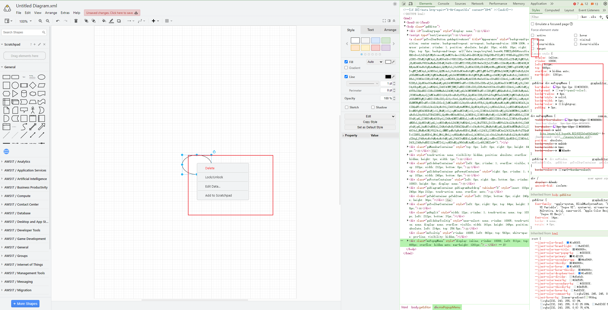

# 相关问题建议

## 图表的交互逻辑

所有的创建逻辑都前置，DrawIO 模块只处理编辑的逻辑。比如，创建图表的时候就是弹窗填写名字，类型等内容，然后创建成功之后编辑才进入 DrawIO 页面。这样做可以减少很多不必要的逻辑，比如创建完成第一次保存之后的跳转。

> 我给的 Demo 里已经给了最简单的例子，包含如何内置几个模板。

## 所有接口的返回格式

```js
// 成功
{
  msg: "成功";
}

// 失败
{
  msg: "失败";
}
```

建议如下：

```js
// 保存成功
{
  code: 200,
  data: id,
  msg: '保存成功'
}


// 保存失败
{
  code: 500,
  msg: '保存失败'
}
```

这样做可以让整个前端是可控的，因为你只给一个成功或者失败的信息，前端应该最合理的是成功给正确的提示，比如绿色，失败给红色的提示，而现在其实前端是没办法直接判断的。

再比如接其实接口是 200 也不一定就是图表存储成功，而是必须返回了创建图表的 id 才认为是创建成功了，并且拿到 id 你还可以做一些事，比如跳转到 id 对应详情之类的相关内容。

> 首先这种规范是很主流的，其次拿到 id 你不是必须要做某些事，而是将来要做某些事的时候后端不需要修改任何逻辑，前后端都省事。

## 如何覆盖样式

系统所有的样式都可以在 `styles/grapheditor.js` 下面进行覆盖，比如想修改邮件弹窗的样式，可以如下寻找覆盖修改：


